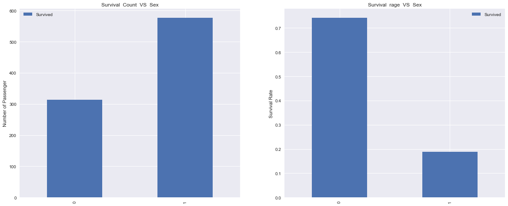
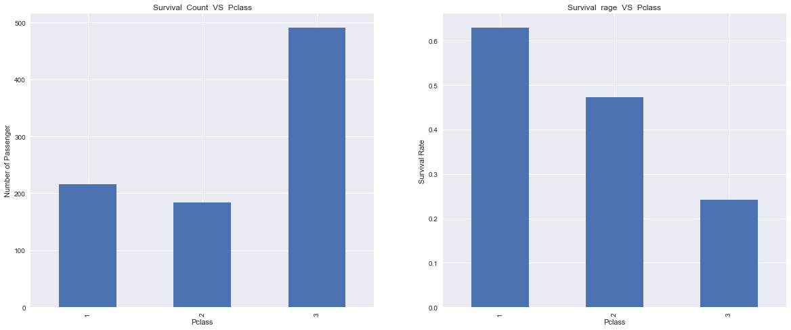
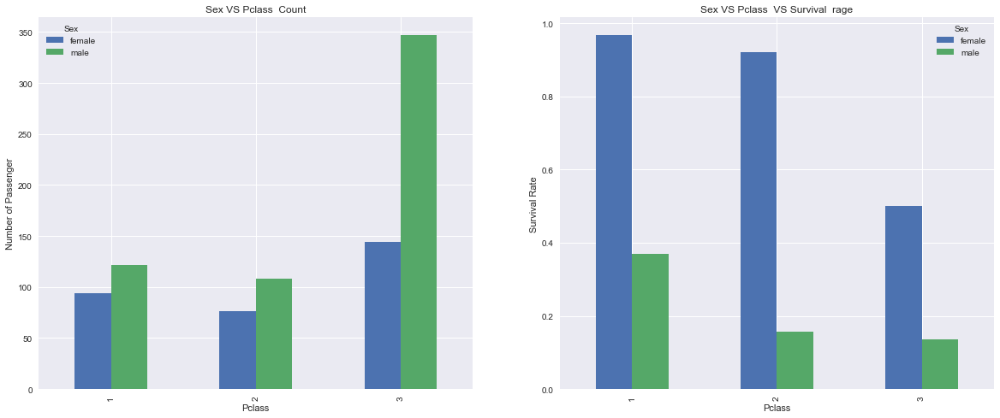

#  泰坦尼克号数据探索

## 本文旨在探索泰坦尼克号乘客的生存率的影响因素，全文分为三大部分：
#### 一、数据概况；
#### 二、数据探索；
#### 三、结论；


## 一、数据概况；


```python
# 引入必要的库
import numpy  as  np
import pandas  as  pd
import matplotlib.pyplot  as  plt
import seaborn  as  sns

%pylab inline

# 导入csv文件的数据，并查看
titanic_df = pd.read_csv('titanic-data.csv')
titanic_df.head()
```

    Populating the interactive namespace from numpy and matplotlib
    


<div>
<table border="1" class="dataframe">
  <thead>
    <tr style="text-align: right;">
      <th></th>
      <th>PassengerId</th>
      <th>Survived</th>
      <th>Pclass</th>
      <th>Name</th>
      <th>Sex</th>
      <th>Age</th>
      <th>SibSp</th>
      <th>Parch</th>
      <th>Ticket</th>
      <th>Fare</th>
      <th>Cabin</th>
      <th>Embarked</th>
    </tr>
  </thead>
  <tbody>
    <tr>
      <th>0</th>
      <td>1</td>
      <td>0</td>
      <td>3</td>
      <td>Braund, Mr. Owen Harris</td>
      <td>male</td>
      <td>22.0</td>
      <td>1</td>
      <td>0</td>
      <td>A/5 21171</td>
      <td>7.2500</td>
      <td>NaN</td>
      <td>S</td>
    </tr>
    <tr>
      <th>1</th>
      <td>2</td>
      <td>1</td>
      <td>1</td>
      <td>Cumings, Mrs. John Bradley (Florence Briggs Th...</td>
      <td>female</td>
      <td>38.0</td>
      <td>1</td>
      <td>0</td>
      <td>PC 17599</td>
      <td>71.2833</td>
      <td>C85</td>
      <td>C</td>
    </tr>
    <tr>
      <th>2</th>
      <td>3</td>
      <td>1</td>
      <td>3</td>
      <td>Heikkinen, Miss. Laina</td>
      <td>female</td>
      <td>26.0</td>
      <td>0</td>
      <td>0</td>
      <td>STON/O2. 3101282</td>
      <td>7.9250</td>
      <td>NaN</td>
      <td>S</td>
    </tr>
    <tr>
      <th>3</th>
      <td>4</td>
      <td>1</td>
      <td>1</td>
      <td>Futrelle, Mrs. Jacques Heath (Lily May Peel)</td>
      <td>female</td>
      <td>35.0</td>
      <td>1</td>
      <td>0</td>
      <td>113803</td>
      <td>53.1000</td>
      <td>C123</td>
      <td>S</td>
    </tr>
    <tr>
      <th>4</th>
      <td>5</td>
      <td>0</td>
      <td>3</td>
      <td>Allen, Mr. William Henry</td>
      <td>male</td>
      <td>35.0</td>
      <td>0</td>
      <td>0</td>
      <td>373450</td>
      <td>8.0500</td>
      <td>NaN</td>
      <td>S</td>
    </tr>
  </tbody>
</table>
</div>


```python
# 查看数据的基本信息
titanic_df.info()
```

    <class 'pandas.core.frame.DataFrame'>
    RangeIndex: 891 entries, 0 to 890
    Data columns (total 12 columns):
    PassengerId    891 non-null int64
    Survived       891 non-null int64
    Pclass         891 non-null int64
    Name           891 non-null object
    Sex            891 non-null object
    Age            714 non-null float64
    SibSp          891 non-null int64
    Parch          891 non-null int64
    Ticket         891 non-null object
    Fare           891 non-null float64
    Cabin          204 non-null object
    Embarked       889 non-null object
    dtypes: float64(2), int64(5), object(5)
    memory usage: 83.6+ KB
    


```python
# 先简单看下数据的基本统计学信息；
titanic_df.describe()
```


<div>
<table border="1" class="dataframe">
  <thead>
    <tr style="text-align: right;">
      <th></th>
      <th>PassengerId</th>
      <th>Survived</th>
      <th>Pclass</th>
      <th>Age</th>
      <th>SibSp</th>
      <th>Parch</th>
      <th>Fare</th>
    </tr>
  </thead>
  <tbody>
    <tr>
      <th>count</th>
      <td>891.000000</td>
      <td>891.000000</td>
      <td>891.000000</td>
      <td>714.000000</td>
      <td>891.000000</td>
      <td>891.000000</td>
      <td>891.000000</td>
    </tr>
    <tr>
      <th>mean</th>
      <td>446.000000</td>
      <td>0.383838</td>
      <td>2.308642</td>
      <td>29.699118</td>
      <td>0.523008</td>
      <td>0.381594</td>
      <td>32.204208</td>
    </tr>
    <tr>
      <th>std</th>
      <td>257.353842</td>
      <td>0.486592</td>
      <td>0.836071</td>
      <td>14.526497</td>
      <td>1.102743</td>
      <td>0.806057</td>
      <td>49.693429</td>
    </tr>
    <tr>
      <th>min</th>
      <td>1.000000</td>
      <td>0.000000</td>
      <td>1.000000</td>
      <td>0.420000</td>
      <td>0.000000</td>
      <td>0.000000</td>
      <td>0.000000</td>
    </tr>
    <tr>
      <th>25%</th>
      <td>223.500000</td>
      <td>0.000000</td>
      <td>2.000000</td>
      <td>20.125000</td>
      <td>0.000000</td>
      <td>0.000000</td>
      <td>7.910400</td>
    </tr>
    <tr>
      <th>50%</th>
      <td>446.000000</td>
      <td>0.000000</td>
      <td>3.000000</td>
      <td>28.000000</td>
      <td>0.000000</td>
      <td>0.000000</td>
      <td>14.454200</td>
    </tr>
    <tr>
      <th>75%</th>
      <td>668.500000</td>
      <td>1.000000</td>
      <td>3.000000</td>
      <td>38.000000</td>
      <td>1.000000</td>
      <td>0.000000</td>
      <td>31.000000</td>
    </tr>
    <tr>
      <th>max</th>
      <td>891.000000</td>
      <td>1.000000</td>
      <td>3.000000</td>
      <td>80.000000</td>
      <td>8.000000</td>
      <td>6.000000</td>
      <td>512.329200</td>
    </tr>
  </tbody>
</table>
</div>


```python
titanic_df.describe(include=['O'])
```


<div>
<table border="1" class="dataframe">
  <thead>
    <tr style="text-align: right;">
      <th></th>
      <th>Name</th>
      <th>Sex</th>
      <th>Ticket</th>
      <th>Cabin</th>
      <th>Embarked</th>
    </tr>
  </thead>
  <tbody>
    <tr>
      <th>count</th>
      <td>891</td>
      <td>891</td>
      <td>891</td>
      <td>204</td>
      <td>889</td>
    </tr>
    <tr>
      <th>unique</th>
      <td>891</td>
      <td>2</td>
      <td>681</td>
      <td>147</td>
      <td>3</td>
    </tr>
    <tr>
      <th>top</th>
      <td>Graham, Mr. George Edward</td>
      <td>male</td>
      <td>CA. 2343</td>
      <td>C23 C25 C27</td>
      <td>S</td>
    </tr>
    <tr>
      <th>freq</th>
      <td>1</td>
      <td>577</td>
      <td>7</td>
      <td>4</td>
      <td>644</td>
    </tr>
  </tbody>
</table>
</div>


可以找出几个有用的信息：
 1. 乘客平均的生存率为0.38；
 2. 大部分数据有891个，较为齐全；
 3. 年龄 和 登船港口 信息缺失，如需研究需要补齐；

## 二、数据探索
有4个初步的想法，文章从**4个方面**探索：
 1. **妇女更有可能生存**；
 2. **儿童更有可能生存**；
 3. **上层乘客更有可能生存**；
 4. **一些新想法**

### 1.性别对生存率的影响

#### （1）左图：不同性别（男 or 女）人口数量分布图:
男女比例大概为2:1，有统计意义；

#### （2）右图：不同性别的存活率图；


```python
plt.figure(figsize = (14, 5))
f, (ax1, ax2) = plt.subplots(1, 2)
ax1.set_title('Survival  Count  VS  Sex')
ax1.set_ylabel('Number of Passenger')
ax2.set_title('Survival  rage  VS  Sex')
ax2.set_ylabel('Survival Rate')
f.set_size_inches((20, 8))
titanic_df.groupby('Sex', as_index=False)['Survived'].count().plot(kind = 'bar', ax = ax1)
titanic_df.groupby('Sex', as_index=False)['Survived'].mean().plot(kind = 'bar', ax = ax2)
```


    <matplotlib.axes._subplots.AxesSubplot at 0x10e29eb8>


    <matplotlib.figure.Figure at 0x117058d0>





女人的生存率为0.74，男人生存率为0.18，差别非常大；

**小结：**

**女士更有可能生还**

### 2. 年龄对生存率的影响
**（1）缺失值填充：**

年龄age有714个，正常有891个，需要处理缺失值，这里采用的方法是用平均值填充；


```python
# 计算平均年龄 
titanic_age_mean = titanic_df['Age'].mean()

# 填充缺失值nan为平均值
titanic_df["Age"] = titanic_df["Age"].fillna(titanic_age_mean)

# 转换年龄的格式从float 到 int
titanic_df['Age']  =  titanic_df['Age'].astype(int)
```

**（2）各年龄段生还率研究：**

* 为了方便分析，将年龄这种连续变量**转化为分类变量**；
* 创建一个**年龄段变量**，比如(0, 10], (10, 20]......然后对乘客根据年龄分组；
* 查看每个年龄段的乘客数量、生还率；


```python
# 生成一个年龄段list
bins = np.arange(0, 90, 10)

# 新建Age_group变量为年龄段
titanic_df['Age_group'] = pd.cut(titanic_df['Age'], bins)
```


```python
plt.figure(figsize = (14, 5))
f, (ax1, ax2) = plt.subplots(1, 2)
ax1.set_title('Survival  Count  VS  Age')
ax1.set_ylabel('Number of Passenger')
ax2.set_title('Survival  rage  VS  Age')
ax2.set_ylabel('Survival Rate')
f.set_size_inches((20, 8))
titanic_df.groupby('Age_group')['Survived'].count().plot(kind = 'bar', ax = ax1)
titanic_df.groupby('Age_group')['Survived'].mean().plot(kind = 'bar', ax = ax2)
```


    <matplotlib.axes._subplots.AxesSubplot at 0x11cfa208>


    <matplotlib.figure.Figure at 0x11597b38>


从上图可以看出，在大概0-10岁的儿童，其生还的概率超过50%，超过其他年龄段；

**小结**：

**儿童更有可能生还**；

### 3.乘客所在船层对生存率的影响
#### （1）左图：不同船层乘客数量柱状图；

#### （2）右图：不同船层乘客生存率柱状图；


```python
plt.figure(figsize = (14, 5))
f, (ax1, ax2) = plt.subplots(1, 2)
ax1.set_title('Survival  Count  VS  Pclass')
ax1.set_ylabel('Number of Passenger')
ax2.set_title('Survival  rage  VS  Pclass')
ax2.set_ylabel('Survival Rate')
f.set_size_inches((20, 8))
titanic_df.groupby('Pclass')['Survived'].count().plot(kind = 'bar', ax = ax1)
titanic_df.groupby('Pclass')['Survived'].mean().plot(kind = 'bar', ax = ax2)
```


    <matplotlib.axes._subplots.AxesSubplot at 0x12e392b0>


    <matplotlib.figure.Figure at 0x12ca9518>





不同船层的乘客生存率有显著差异：
* Pclass为1，即在 船上层 的乘客生存率为0.63；
* Pclass为2，即在 船中层 的乘客生存率为0.47；
* Pclass为3，即在 船底层 的乘客生存率为0.24；

**小结：**

** 上层乘客更有可能生存**


### 4.一些新想法 

既然性别，船层对生还率都有影响，那么她们的组合因素有没有影响呢，
所以做了以下探究：

####  左图：不同性别、船层 的乘客数量图形
####  右图：不同性别，船层 的乘客生还率图形


```python
plt.figure(figsize(14, 5))
f, (ax1, ax2) = plt.subplots(1,2)
ax1.set_title('Sex VS Pclass  Count')
ax1.set_ylabel('Number of Passenger')
ax2.set_title('Sex VS Pclass  VS Survival  rage')
ax2.set_ylabel('Survival Rate')
f.set_size_inches((20, 8))
titanic_df.groupby(['Pclass', 'Sex'])['Survived'].count().unstack().plot(kind = 'bar', ax = ax1)
titanic_df.groupby(['Pclass', 'Sex'])['Survived'].mean().unstack().plot(kind = 'bar', ax = ax2)
```


    <matplotlib.axes._subplots.AxesSubplot at 0x1102fa90>


    <matplotlib.figure.Figure at 0x114c1550>





可以看出，船上层 和 中层的女生绝大多数都存活下来，

且整体看 **存活率由高到低**依次是：

**(1.female) > (2,female) > (3,female) > (1,male) > (2,male) > (3,male)**

**小结：**

**无论是男性还是女性，存活率都随着pclass的增加而降低；**

## 三、结论：

 1. 本报告所用乘客数据集为891名，实际乘客为2224名，样本占总量的40.1%，可以代表整个整体，结论仍有可能有偏差，但是分析结果在统计学上可以认为是正确的；
 2. 对年龄缺失值采用平均值替代的处理可能会造成偏差，关于年龄部分的结论还需要再探究寻找更加合理的方式；
 3. 个人认为还有其他影响存活率的因素，比如：职业，地区，收入等；
 4. 真实的影响因素是多样且互相关联的，本文得出的所有结论只是很简单的分析某些变量与生存率的关系，一家之言，欢迎交流；
